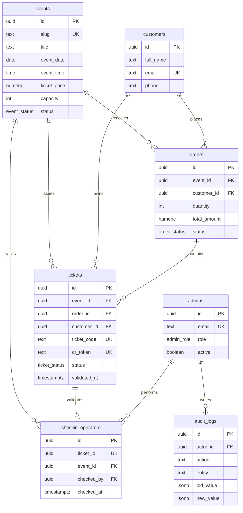

# FARECOH Event Platform Architecture

## Objetivo del MVP

La plataforma queda preparada para operar eventos culturales de FARECOH con un primer evento productivo: `pink-floyd`, Tributo a Pink Floyd 2026. La arquitectura separa experiencia pública, administración, datos transaccionales y validación de ingreso.

## Capas

- `src/pages`: rutas públicas y privadas de Astro.
- `src/components`: piezas visuales reutilizables.
- `src/lib`: integración base y validaciones compartidas.
- `src/services`: lógica de aplicación reusable para órdenes, códigos, check-in y reportes.
- `src/types`: contratos TypeScript entre UI, servicios y base de datos.
- `schema.sql`: modelo PostgreSQL/Supabase con RLS, funciones transaccionales y auditoría.
- `seed.sql`: evento inicial listo para ambiente Supabase.
- `tests`: pruebas de reglas críticas de ticketing.

## Modelo ER

## Reglas críticas

- Todo evento público se consulta por `event_slug`.
- Los boletos usan formato `PF-000001` mediante secuencia de PostgreSQL.
- La generación real de órdenes debe ejecutarse en backend o función RPC, no desde cliente público.
- El check-in usa `validate_ticket`, bloquea la fila con `for update` e impide doble validación.
- `checkin_operators.ticket_id` es `unique`, segunda barrera contra duplicados.
- RLS permite lectura pública solo de eventos activos; datos transaccionales quedan para admins o funciones `security definer`.
- `audit_logs` registra creación de órdenes y validaciones.

## Seguridad

- Supabase Auth maneja administradores.
- `admins` referencia `auth.users`.
- Las políticas usan `public.is_admin()`.
- El formulario público debe llamar un endpoint server-side con rate limiting y validación Zod.
- Nunca exponer `service_role` al navegador.

## Próximas fases

1. Crear endpoints Astro server-side para reserva y check-in.
2. Sustituir el mock local por RPCs Supabase.
3. Añadir login admin con Supabase Auth.
4. Añadir QR real por `qr_token` y página/endpoint de verificación.
5. Añadir exportación CSV/PDF para reportes.
