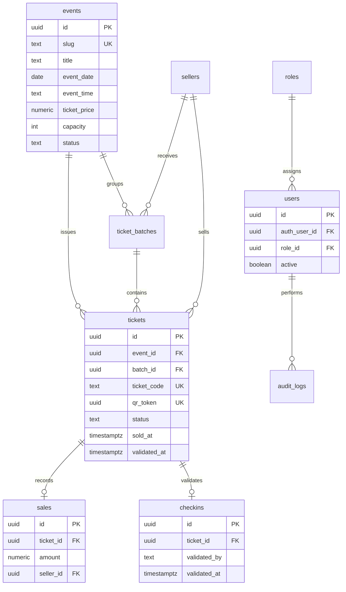

# FARECOH Event Platform Architecture

## Objetivo del MVP

La plataforma queda preparada para operar eventos culturales de FARECOH con un primer evento productivo: `pink-floyd`, Tributo a Pink Floyd 2026. La arquitectura separa experiencia pública, administración, datos transaccionales y validación de ingreso.

## Capas

- `src/pages`: rutas públicas y privadas de Astro.
- `src/components`: piezas visuales reutilizables.
- `src/lib`: integración base y validaciones compartidas.
- `src/services`: lógica de aplicación reusable para órdenes, códigos, check-in y reportes.
- `src/types`: contratos TypeScript entre UI, servicios y base de datos.
- `supabase/migrations/001_ticketing_core.sql`: modelo PostgreSQL/Supabase canónico con RLS, RPCs transaccionales y auditoría.
- `docs/database-setup.md`: pasos de ejecución y verificación en Supabase.
- `tests`: pruebas de reglas críticas de ticketing.

## Modelo ER

## Reglas críticas

- Todo evento público se consulta por `slug`.
- Los boletos usan formato `PF-000001` … `PF-000500` para Pink Floyd.
- La reserva pública usa RPC `create_ticket_order` y deja boletos en `reserved`.
- La venta física usa RPC `sell_physical_ticket` y deja boletos en `sold`.
- El check-in usa RPC `validate_ticket`, bloquea la fila con `FOR UPDATE` e impide doble validación.
- RLS restringe escrituras directas; operaciones sensibles pasan por RPCs `SECURITY DEFINER`.
- `audit_logs` registra reservas, ventas y validaciones.

## Seguridad

- Supabase Auth maneja administradores.
- `users` referencia `auth.users` y `roles`.
- Las políticas usan `public.get_auth_user_role()` e `public.is_admin()`.
- El formulario público reserva vía RPC anon; venta y check-in requieren sesión staff.
- Nunca exponer `service_role` al navegador.

## Próximas fases

1. Exportación CSV/PDF para reportes.
2. Panel de lotes (`ticket_batches`) conectado al inventario físico.
3. Notificaciones de confirmación de reserva por correo.
