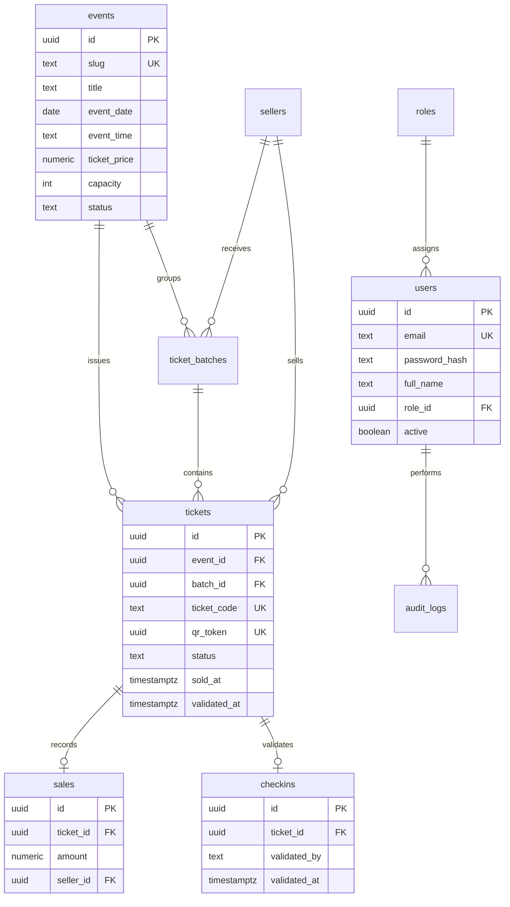

# FARECOH Event Platform Architecture

## Objetivo del MVP

La plataforma queda preparada para operar eventos culturales de FARECOH con un primer evento productivo: `pink-floyd`, Tributo a Pink Floyd 2026. La arquitectura separa experiencia pública, administración, datos transaccionales y validación de ingreso.

## Capas

- `src/pages`: rutas públicas y privadas de Astro.
- `src/components`: piezas visuales reutilizables.
- `src/lib`: integración base y validaciones compartidas.
- `src/services`: lógica de aplicación reusable para órdenes, códigos, check-in y reportes.
- `src/types`: contratos TypeScript entre UI, servicios y base de datos.
- `database/schema.sql`: modelo PostgreSQL canónico con tablas, índices, RPCs transaccionales y auditoría para Railway.
- `docs/database-setup.md`: pasos de ejecución y verificación en PostgreSQL.
- `tests`: pruebas de reglas críticas de ticketing.

## Modelo ER

```mermaid
erDiagram
  roles ||--o{ users : assigns
  events ||--o{ ticket_batches : groups
  events ||--o{ tickets : issues
  ticket_batches ||--o{ tickets : contains
  sellers ||--o{ ticket_batches : receives
  sellers ||--o{ tickets : sells
  tickets ||--o| sales : records
  tickets ||--o| checkins : validates
  users ||--o{ audit_logs : performs

  events {
    uuid id PK
    text slug UK
    text title
    date event_date
    text event_time
    numeric ticket_price
    int capacity
    text status
  }

  tickets {
    uuid id PK
    uuid event_id FK
    uuid batch_id FK
    text ticket_code UK
    uuid qr_token UK
    text status
    timestamptz sold_at
    timestamptz validated_at
  }

  sales {
    uuid id PK
    uuid ticket_id FK
    numeric amount
    uuid seller_id FK
  }

  checkins {
    uuid id PK
    uuid ticket_id FK
    text validated_by
    timestamptz validated_at
  }

  users {
    uuid id PK
    text email UK
    text password_hash
    text full_name
    uuid role_id FK
    boolean active
  }
```

## Reglas críticas

- Todo evento público se consulta por `slug`.
- Los boletos usan formato `PF-000001` … `PF-000500` para Pink Floyd.
- La reserva pública usa RPC `create_ticket_order` y deja boletos en `reserved`.
- La venta física usa RPC `confirm_ticket_payment` y deja boletos en `sold`.
- El check-in usa RPC `validate_ticket` o `validate_ticket_by_qr`, bloquea la fila con `FOR UPDATE` e impide doble validación.
- Conexión directa a PostgreSQL vía `pg.Pool` con soporte SSL para Railway.
- `audit_logs` registra reservas, ventas y validaciones.

## Seguridad

- Autenticación administrativa nativa (`crypto.scrypt` + cookies de sesión firmadas con HMAC-SHA256).
- `users` almacena `password_hash` y referencia `roles`.
- Las rutas administrativas son protegidas mediante middleware Astro (`/admin/*`) y control de acceso basado en roles (RBAC).
- Variables de entorno seguras (`DATABASE_URL`, `AUTH_SECRET`).

## Próximas fases

1. Exportación CSV/PDF para reportes.
2. Panel de lotes (`ticket_batches`) conectado al inventario físico.
3. Notificaciones de confirmación de reserva por correo.
